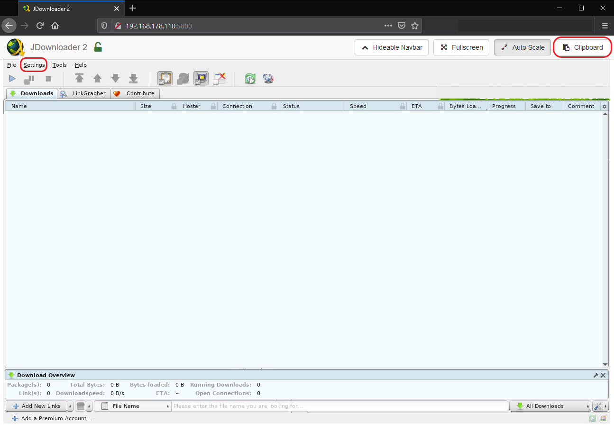
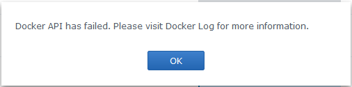
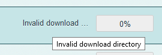
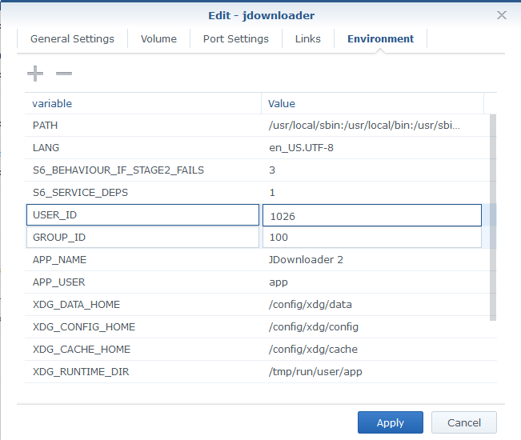
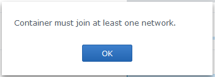

# JDownloader through NordVPN in Docker (Synology)

A simple step by step guide on how to configure JDownloader 2 to run inside a Docker container (on a Synology NAS) with only its traffic routed through NordVPN.

- Synology NAS running DSM 6.2
- Default Synology Docker application
- JDownloader running on a container
- NordVPN running on a separate container

Some of the tips in the Troubleshooting section might also apply to other Docker hosts or VPN clients.

### TL;DR
One JDownloader container with its traffic routed through another container with NordVPN. All other containers and the host itself stay unaffected and accesible on LAN.

### The slightly longer version
The Synology NAS is a great tool even if only for its basic functionality. However, many will use it for many purposes, just like me. For example, this is a small insight into my setup:

- Shared folders
- Volume dedicated to Time Machine
- Plex Server
- Docker
    - Pi-Hole
    - Ombi server for Plex
    - Telegram Bot for Ombi
    - Homebridge
    - On-demand Minecraft servers

For a while I used a regular installation of JDownloader 2 for DSM. The next move is then to route the traffic for JDownloader through the VPN.

##### 🤔 Wait a second, can't NordVPN already be used on Synology simply by installing an OpenVPN profile?
Indeed, it can. If what you are looking for is to route all the traffic through the VPN, go ahead and follow the simple [official setup guide](https://support.nordvpn.com/Connectivity/NAS/1047411072/How-to-configure-Synology-6-1-NAS.htm). It works fine and does exactly what it's supposed to.

But take a second look at my setup above. As soon as all traffic goes through the VPN, everything starts to slow down, fall apart and I lose local and/or remote access to the rest of containers and applications; far from ideal.


## Before we start

##### Enable the SSH service
To follow the steps below you will need to SSH into your Synology NAS.
1. Open the Synology **_Control Panel_** and navigate to **_Terminal & SNMP_**.
2. Check the option **_Enable SSH service_**. Although not strictly necessary, it is recommended to specify a port other than the default `22`.


Now you can simply SSH into your Synology NAS like this:

```
ssh <user>@<Synology local IP> -p <port>
```

Example:
```
ssh michael@192.168.0.2 -p 77
```
You will now be prompted to enter the password for the user.

>As noted in the image above, only Synology users belonging to the administrators group can login using SSH.

##### Install Docker

1. Open the **_Package Center_** and search for _Docker_
2. Click on **_Install_** and follow the instructions.


## Creating the Docker containers
All the commands used in this sections are to be used from within the SSH session.
> Running `sudo` commands will prompt you to enter a password from time to time. Use the password for the Synology user currently logged into the SSH-session.

##### Downloading the images

We will be using the following Docker images:
- [bubuntux/nordvpn](https://hub.docker.com/r/bubuntux/nordvpn)
  - `https://hub.docker.com/r/bubuntux/nordvpn`
- [jlesage/jdownloader-2](https://hub.docker.com/r/jlesage/jdownloader-2)
  - `https://hub.docker.com/r/jlesage/jdownloader-2`

To install them:
1. Open the Docker application inside Synology.
2. Navigate to **_Image_** and click on **_Add > Add from URL_**.
3. In the prompt, enter the image's URL and click on **_Add_**.
4. If prompted to, select the _latest_ tag and continue.


##### Launching the containers
###### NordVPN
>We could create the containers from within the Docker GUI, however, the functionality is limited and not all options we need are available.

Since the `jdownloader` container **needs** to use the network provided by the `nordvpn` container, we need to create `nordvpn` first:

```
sudo docker run -ti \
--cap-add=NET_ADMIN \
--cap-add=SYS_MODULE \
--device /dev/net/tun \
--name nordvpn \
-e USER=<NORDVPN_EMAIL> \
-e PASS='<NORDVPN_PASSWORD>' \
-e CONNECT=de \
-e TECHNOLOGY=NordLynx \
-e NETWORK=<ROUTER_LOCAL_IP>/24 \
-e TZ=Europe/Berlin \
-p 5800:5800 \
-p 3129:3129 \
-d bubuntux/nordvpn
```
> Just in case you were wondering what those `\` at the end of each line are doing: They tell your Terminal not to execute the command but instead await a new line. This is often done for easier readability when using lots of arguments.

You will need to replace the following information:

|Tag|Content|
|:--|:--|
|`<NORDVPN_EMAIL>`|Your NordVPN email.|
|`<NORDVPN_PASSWORD>`|Your NordVPN password.|
|`<ROUTER_LOCAL_IP>`|Your router's local IP. This will probably something like `192.168.0.1`. <br>The `/24` after the IP represents the subnet mask. Use: <br>`/24` for `255.255.255.0` <br>or <br>`/16` for `255.255.0.0`|

Please refer to the [official NordVPN Docker documentation](https://github.com/bubuntux/nordvpn#environment-variables) for a detailed description of the rest of parameters.

##### What are those port mappings for?

Take a look at the command above again. You might have noticed these two lines:
```
-p 5800:5800 \
-p 3129:3129 \
```
Those are port mappings between the host and the container. We will need those in order to be able to access the `jdownloader` container. However, since it's the `nordvpn` container who creates the network, they must be specified here.

|Port|Details|
|:--|:--|
|`5800`|Needed to access the JDownloader GUI for setup|
|`3129`|Optional. Allows for a direct connection through MyJDownloader. If you don't plan to access your JDownloader through MyJDownloader, you may remove this port mapping.|

###### JDownloader

This container requires two volumes to be mounted, `/config` and `/output`. If necessary, create the necessary folders in your Synology NAS.

|Synology (host) path|Path the container sees|Details|
|:--|:--|:--|
|`/volume1/docker/jdownloader`|`/config`|Where your configuration is stored.|
|`/volume1/Downloads`|`/output`|Where your files will be downloaded to.|

Volumes are mounted using the syntax: `-v "<host path>:<container path>:rw"`. The `:rw` at the end denotes the container will have read/write access rights.

We can now run the `jdownloader` container:
```
sudo docker run -ti \
--network=container:nordvpn \
--name jdownloader \
-v "/volume1/docker/jdownloader:/config:rw" \
-v "/volume1/Downloads:/output:rw" \
-d jlesage/jdownloader-2
```

> In case you ever need to delete the `jdownloader` container, as long as you map the `/config` directory from the container to the same path on your host, your configuration will still be available. Furthermore, (although untested) in case you already have a JDownloader configuration, you should be able to use it by mounting the corresponding directory.

##### Accessing JDownloader
You can now open your browser and navigate to `http://<Synology NAS IP>:5800` and you should be able to reach your JDownloader instance running inside the Docker container.

>When starting your first download, it is possible that JDownloader will show an error regarding _Invalid download directory_. This is due to the fact that, although we mounted the `/output` directory, the user for which the `jdownloader` container is running doesn't have the necessary access rights. Please refer to the _Troubleshooting_ section further down for a step by step fix.

***Phew...job done, right!?***

Well, I would recommend setting up MyJDownloader to access your JDownloader. This has a few advantages:
- Access remotely, not just from your local network (or messing around with port forwarding rules in your router)
- Access from mobile apps
- "Native" browser interface, instead of a application interface from within the browser
- You don't sacrifice anything and still can tweak all possible settings, update, restart, etc.



From the ***Settings*** menu you can enter your MyJDownloader credentials (or create a new account), as well as give it a shiny new name you like.

> If you need to paste anything from your computer's clipboard into the JDownloader running inside the browser, you can use the tool in the top right corner of the windows. This might be the case if you use a long, auto-generated password stored in a password manager (which you totally should be using, btw.).

Once you enter your credentials and your JDownloader is linked with your MyJDownloader account, you can close this windows and never open it again. Head over to https://my.jdwonloader.org and you should be able to access from there.

> Since we won't be needing to access the application using the port 5800 anymore, we could, theoretically, remove its mapping from the `nordvpn` container to limit LAN access to our JDownloader.


## Where to go from here?


Let me guess what you are thinking: *How could I exploit this to bypass download limits?* Well, I won't go into that. However, when you connect to a new VPN server, you usually get a new IP. I'll leave it at that.

> Keep in mind: If you restart the `nordvpn` container, you will have to restart the `jdownloader` container, too. Additionally, restarting your `nordvpn` container might reconnect you to the same server you were already connected to.

You can enter into the docker container through the terminal using:
```
sudo docker exec -it nordvpn bash
```

You can read more about NordVPN commands in the [official NordVPN Linux guide](https://support.nordvpn.com/Connectivity/Linux/1325531132/Installing-and-using-NordVPN-on-Debian-Ubuntu-Elementary-OS-and-Linux-Mint.htm#Settings).
    

## Troubleshooting

##### Missing `/dev/net/tun` device / Docker API has failed



Indeed, if we take a look at the Docker log, we will find an Error entry with the following Event:

`Start container nordvpn failed: {"message":"linux runtime spec devices: error gathering device information while adding custom device \"/dev/net/tun\": no such file or directory"}.`

If we were running the container from the console, it could look like this:

`Error response from daemon: linux runtime spec devices: error gathering device information while adding custom device "/dev/net/tun": no such file or directory.`

I found the solution [here](https://github.com/binhex/arch-delugevpn/issues/67#issuecomment-399380209) does do the trick. Type in these two commands

```
sudo insmod /lib/modules/tun.ko
```
No response here is perfectly normal. Go on with the second one:
```
insmod /lib/modules/iptable_mangle.ko
```
If it returns the error `insmod: ERROR: could not insert module /lib/modules/iptable_mangle.ko: File exists` that's perfectly fine. You should now be able to restart the `nordvpn` container using:
```
sudo docker container restart nordvpn
```

---
##### *Invalid download directory* in JDownloader download


When Docker runs your `jdownloader` container, it does so by using a specific user and group ID. This error occurs when your `jdownloader` uses the ID of a user that doesn't have read/write permissions for the mounted volume (Synology path) mounted as `/output`.

The easiest fix for this is to run the container using your user and group IDs. To find out what these IDs are, just type in:
```
id
```
which should give you an output like this:
```
uid=1026(michael) gid=100(users) groups=100(users),101(administrators)
```

Now we must tell Docker to run `jdownloader` as user (uid) `1026` and group (gid) `100`.

1. Stop `jdownloader` from the Docker GUI.
2. Right click on it and select ***Edit***.
3. Go to the ***Environment*** tab and enter the corresponding `uid` and `gid` that you got when running the `id` command.




---
##### *Container must join at least one network* when starting the `jdownloader` container


Our `jdownloader` container requires the information on restart about which network to join. You will see the error above if you try to start the container from the Synology Docker GUI. Instead, you can do this from the console:
```
sudo docker container restart jdownloader
```