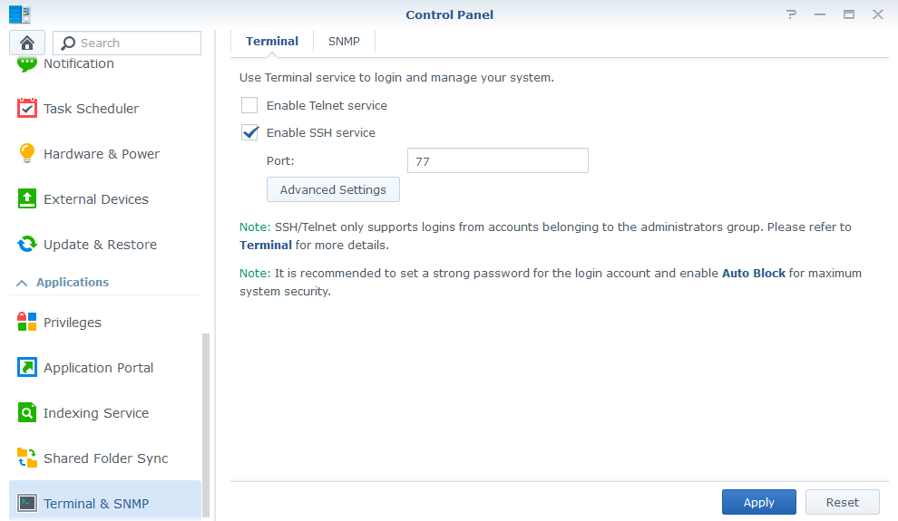
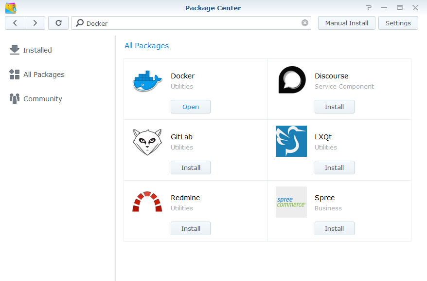
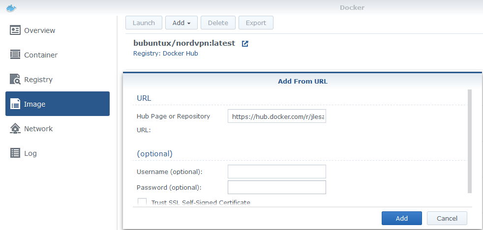

# JDownloader through NordVPN in Docker (Synology)

A simple step by step guide on how to configure JDownloader 2 to run inside a Docker container (on a Synology NAS) with only its traffic routed through NordVPN.

- Synology NAS running DSM 6.2
- Default Synology Docker application
- JDownloader running on a container
- NordVPN running on a separate container

Some of the tips in the Troubleshooting section might also apply to other Docker hosts or VPN clients.

### TL;DR
One JDownloader container with its traffic routed through another container with NordVPN. All other containers and the host itself stay unaffected and accesible on LAN.

### The slightly longer version
The Synology NAS is a great tool even if only for its basic functionality. However, many will use it for many purposes, just like me. For example, this is a small insight into my setup:

- Shared folders
- Volume dedicated to Time Machine
- Plex Server
- Docker
    - Pi-Hole
    - Ombi server for Plex
    - Telegram Bot for Ombi
    - Homebridge
    - On-demand Minecraft servers

For a while I used a regular installation of JDownloader 2 for DSM. The next move is then to route the traffic for JDownloader through the VPN.

##### 🤔 Wait a second, can't NordVPN already be used on Synology simply by installing an OpenVPN profile?
Indeed, it can. If what you are looking for is to route all the traffic through the VPN, go ahead and follow the simple [official setup guide](https://support.nordvpn.com/Connectivity/NAS/1047411072/How-to-configure-Synology-6-1-NAS.htm). It works fine and does exactly what it's supposed to.

But take a second look at my setup above. As soon as all traffic goes through the VPN, everything starts to slow down, fall apart and I lose local and/or remote access to the rest of containers and applications; far from ideal.

---
## Before we start

##### Enable the SSH service
To follow the steps below you will need to SSH into your Synology NAS.
1. Open the Synology **_Control Panel_** and navigate to **_Terminal & SNMP_**.
2. Check the option **_Enable SSH service_**. Although not strictly necessary, it is recommended to specify a port other than the default `22`.



Now you can simply SSH into your Synology NAS like this:

```bash
ssh <user>@<Synology local IP> -p <port>

Example:
ssh michael@192.168.0.2 -p 77
```
You will now be prompted to enter the password for the user.

>As noted in the image above, only Synology users belonging to the administrators group can login using SSH.

##### Install Docker

1. Open the **_Package Center_** and search for _Docker_
2. Click on **_Install_** and follow the instructions.



---
## Creating the Docker containers
All the commands used in this sections are to be used from within the SSH .
> Running `sudo` commands will prompt you to enter a password from time to time. Use the password for the Synology user currently logged into the SSH-session.

##### Downloading the images

We will be using the following Docker images:
- [bubuntux/nordvpn](https://hub.docker.com/r/bubuntux/nordvpn)
  - `https://hub.docker.com/r/bubuntux/nordvpn`
- [jlesage/jdownloader-2](https://hub.docker.com/r/jlesage/jdownloader-2)
  - `https://hub.docker.com/r/jlesage/jdownloader-2`

Install both images:
1. Open the Docker application inside Synology.
2. Navigate to **_Image_** and click on **_Add > Add from URL_**.
3. In the prompt, enter the image's URL and click on **_Add_**.
4. If prompted to, select the _latest_ tag and continue.



##### Launching the containers
###### NordVPN
We could create the containers from within the Docker GUI, however, the functionality is limited and not all option we need are available. We will use this from the terminal, instead.

Since the `jdownloader` container **needs** to use the network provided by the `nordvpn` container, we need to create the latter first:

```
sudo docker run -ti \
--cap-add=NET_ADMIN \
--cap-add=SYS_MODULE \
--device /dev/net/tun \
--name nordvpn \
-e USER=<NORDVPN_EMAIL> \
-e PASS='<NORDVPN_PASSWORD>' \
-e CONNECT=de \
-e TECHNOLOGY=NordLynx \
-e NETWORK=<ROUTER_LOCAL_IP>/24 \
-e TZ=Europe/Berlin \
-p 5800:5800 \
-p 3129:3129 \
-d bubuntux/nordvpn
```
> Just in case you were wondering what those `\` at the end of each line are doing: They tell your Terminal not to execute the command but instead await a new line. This is often done for easier readability when using lots of arguments.

You will need to replace the following information:

|Tag|Content|
|:--|:--|
|`<NORDVPN_EMAIL>`|Your NordVPN email.|
|`<NORDVPN_PASSWORD>`|Your NordVPN password.|
|`<ROUTER_LOCAL_IP>`|Your router's local IP. This will probably something like `192.168.0.1`. <br>The `/24` after the IP represents the subnet mask. Use: <br>`/24` for `255.255.255.0` <br>or <br>`/16` for `255.255.0.0`|

Please refer to the [official NordVPN Docker documentation](https://github.com/bubuntux/nordvpn#environment-variables) a detailed description of the rest of parameters.

##### What are those port mappings for?

Take a look at the command above again. You might have noticed these two lines:
```
-p 5800:5800 \
-p 3129:3129 \
```
Those are port mappings between the host and the container. We will need those in order to be able to access the `jdownloader` container. However, since it's the `nordvpn` container who creates the network the other container will use, they must be specified here.

- `5800` this is the port used to access the JDownloader GUI for setup.
- `3129` this port allows for a direct connection through MyJDownloader. If you don't plan to access your JDownloader through MyJDownloader, you can remove this port mapping.

###### JDownloader

This container requires two volumes to be mounted, `/config` and `/output`. The former will be where your configuration is stored and the latter where your files will be downloaded to. If necessary, create the necessary folders in your Synology NAS.

In my case, I have decided to mount the following folder:

|Synology (host) path|The path the container sees|
|:--|:--|
|`/volume1/docker/jdownloader`|`/config`|
|`/volume1/Downloads`|`/output`|

Volumes are mounted using the syntax: `-v "<host path>:<container path>:rw"`. The `:rw` at the end denotes the container will have read/write access rights.

We can now run the `jdownloader` container:
```
sudo docker run -ti \
--network=container:nordvpn \
--name jdownloader \
-v "/volume1/docker/jdownloader:/config:rw" \
-v "/volume1/Downloads:/output:rw" \
-d jlesage/jdownloader-2
```

> In case you ever need to delete the `jdwonloader` container, as long as you map the `/config` directory from the container to the same path on your host, your configuration will still be available.

##### Accessing JDownloader
You can now open your browser and navigate to `http://<Synology NAS IP>:5800` and you should be able to reach your JDownloader instance running inside the Docker container.

>When starting your first download, it is possible that JDownloader will show an error regarding _Invalid download directory_. This is due to the fact that, although we mounted the `/output` directory, the user for which the `jdownloader` container is running doesn't have the necessary access rights. Please refer to the _Troubleshooting_ section further down for a step by step fix.

##### Setting up MyJDownloader


---
## Where to go from here?

- refresh vpn for a new IP to bypass download limits
    - restart nordvpn
        - jdownload restart required, too, because it loses the network reference
        - not guaranteed to connect to a different vpn server
    - manually connect to 
    
---
## Troubleshooting

##### Missing `/dev/net/tun` device
`Error response from daemon: linux runtime spec devices: error gathering device information while adding custom device "/dev/net/tun": no such file or directory.`

Indeed, if we take a look at the Docker log, we will find an Error entry with the following Event:

`Start container nordvpn failed: {"message":"linux runtime spec devices: error gathering device information while adding custom device \"/dev/net/tun\": no such file or directory"}.`

https://github.com/binhex/arch-delugevpn/issues/67#issuecomment-399380209


##### invalid download directory
- set UID and GUID

##### restart jdownload requires join network
restart from command line
```
sudo docker container restart jdownloader
```